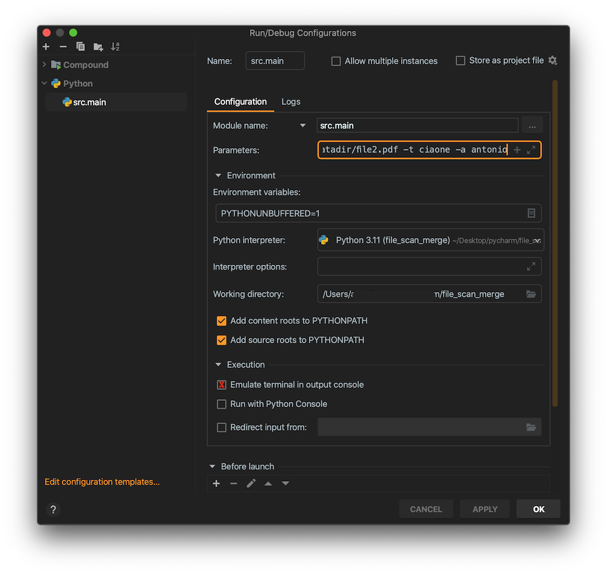

# merge_pdf

Risolvere il problema degli ADF che scansionano una singola facciata.

1. scansionare tutte le facciate dispari
2. scansionare tutte le facciate pari
3. usare questo too per ottenere un unico file pdf

# usage

```bash
# activate env

pyton3 -m src.main -fa file1.pdf -fb file2.pdf -out outputfile.pdf -t "title" -a "author"

# deactivate env
```

# working

## ref/1.1

Il documento che si intende scannerizzare e' formato come di seguito


la scansione avviene come


generando due file. Il file A contiene le pagine in ordine invece il file B contiene le pagine in ordine inverso.

## ref/1.2

*Quindi* si vuole ottenenere un unico file del tipo


# running configuration



Config params

```
-fa ./datadir/file1.pdf -fb ./datadir/file2.pdf -out ./datadir/outfile.pdf -t ciaone -a antonio
```
